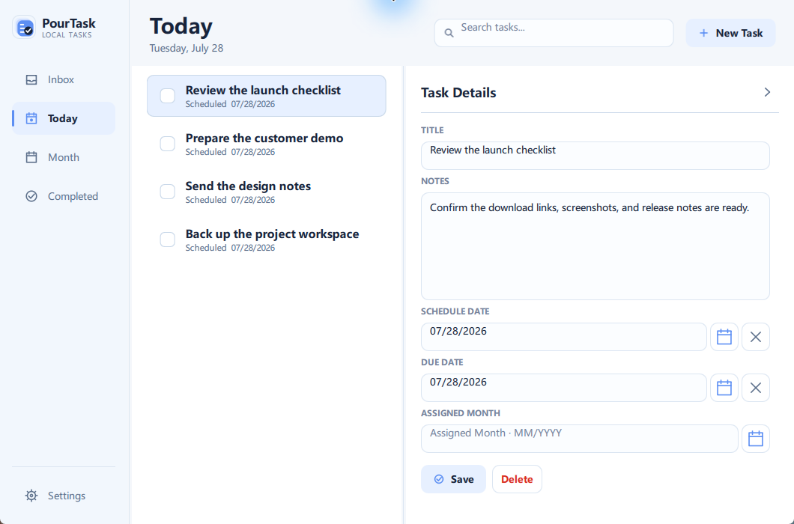
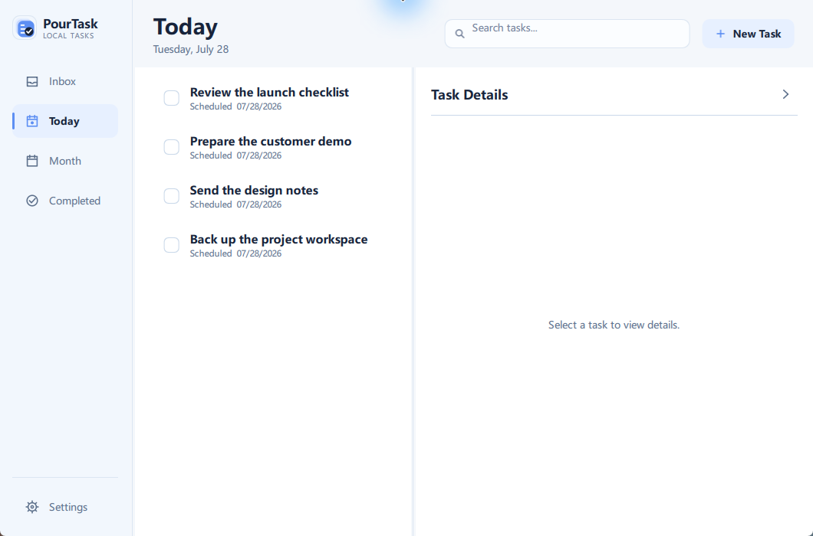
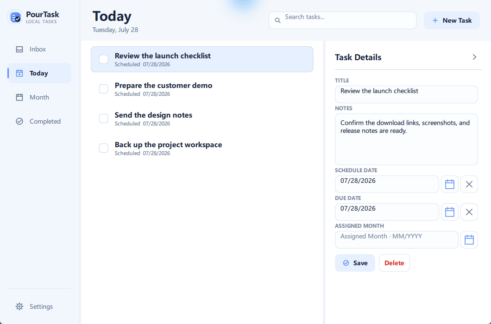
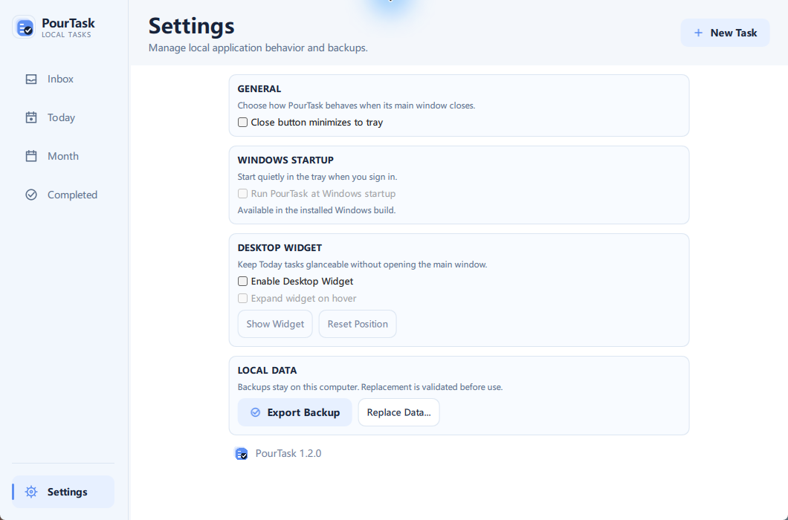
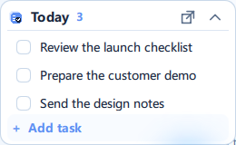

<p align="center">
  
</p>

<h1 align="center">PourTask</h1>

<p align="center">
  A calm, local-first task manager made for the Windows desktop.
</p>

<p align="center">
  <a href="https://github.com/pour-soi/PourTask/releases/latest"></a>
  
  
  <a href="https://github.com/pour-soi/PourTask/actions/workflows/build.yml"></a>
  <a href="LICENSE"></a>
</p>

<p align="center">
  <a href="https://github.com/pour-soi/PourTask/releases/latest"><strong>Download for Windows</strong></a>
  ·
  <a href="README_CN.md">简体中文</a>
</p>



PourTask keeps everyday planning close at hand without asking you to create an account or move your tasks to a cloud service. Capture work in Inbox, focus on Today, plan by month, and make changes in a responsive editor that stays out of the way when you do not need it.

## Download

Get the current stable release from the [PourTask Releases page](https://github.com/pour-soi/PourTask/releases/latest).

| Choose | Best for |
| --- | --- |
| **Windows Setup** — `PourTask-v1.2.0-Windows-Setup.exe` | A normal installation with Start Menu integration and optional desktop shortcut |
| **Portable ZIP** — `PourTask-v1.2.0-Windows.zip` | Running PourTask from an extracted folder without an installer |

For the portable edition, keep `PourTask.exe` beside its `_internal` folder. Windows may show an unknown-publisher warning because PourTask is not currently code-signed.

## Screenshots

### A focused place for today



The task list can take the full working area when you want a quiet overview. Select a task—or choose **New Task**—and the editor returns with your draft intact.

### Details that adapt to the space



The editor reflows around its actual panel width. Notes, dates, month assignment, and actions remain readable and reachable as the splitters move.

### Desktop behavior in one place



Settings keep Windows startup, widget visibility, position recovery, and local backup controls clear without crowding the main task workflow.

## Features

- **Inbox, Today, and Month** — move naturally from quick capture to daily focus and longer-range planning.
- **Complete task details** — add notes, schedule dates, due dates, and an assigned month before saving.
- **Flexible date entry** — type familiar U.S. dates or choose them from built-in calendar and month pickers.
- **Fast search** — find text across task titles and notes.
- **Completion and undo** — finish, restore, or delete tasks without losing the flow of your list.
- **Local backups** — export a backup and validate replacement data before it is used.
- **Windows integration** — tray controls, optional startup, remembered geometry, and single-instance behavior.
- **Keyboard-friendly editing** — navigate, create, save, cancel, search, and undo with shortcuts.

## Desktop Widget

<p align="center">
  
</p>

The desktop widget is a small view of Today—not a miniature copy of the full application.

- See real Today task titles at a glance.
- Complete tasks without opening the main window.
- Add a task from a compact inline field.
- Switch between Compact and Expanded modes.
- Optionally expand after a short hover.
- Recover the widget with **Show Widget** or **Reset Position**.

Changes stay synchronized with the main window without continuous polling.

## Responsive Layout

PourTask is designed to resize like desktop software should. The sidebar, task list, and editor use two draggable splitters, remember their positions, and adapt from the 720 × 520 minimum window through maximized layouts.

The editor can collapse manually or make room automatically when the window becomes too narrow. Draft content remains intact, and saved window geometry is recovered safely when monitor or DPI arrangements change.

## Local-first Philosophy

Your tasks belong on your computer.

- No account is required.
- Task data is stored in a local SQLite database.
- There is no telemetry or automatic log upload.
- PourTask does not include cloud or multi-device synchronization.
- Backups, settings, and logs stay under `%LOCALAPPDATA%\PourTask`.

Removing the application does not silently remove your task database.

## Technology

PourTask is built with [Python](https://www.python.org/), [PySide6](https://doc.qt.io/qtforpython-6/), Qt Quick/QML, and SQLite. Windows releases are packaged with PyInstaller and Inno Setup.

<details>
<summary>Run from source</summary>

Python 3.12 or newer is required.

```powershell
python -m venv .venv
.\.venv\Scripts\python.exe -m pip install -r requirements.txt
.\scripts\run_dev.ps1
```

Run the test suite with:

```powershell
.\scripts\test.ps1
```

</details>

## License

PourTask is available under the [MIT License](LICENSE).
